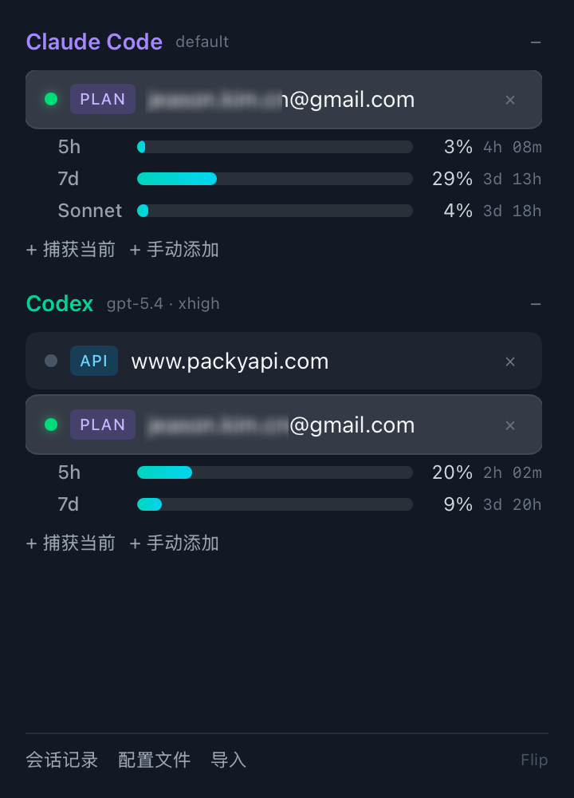
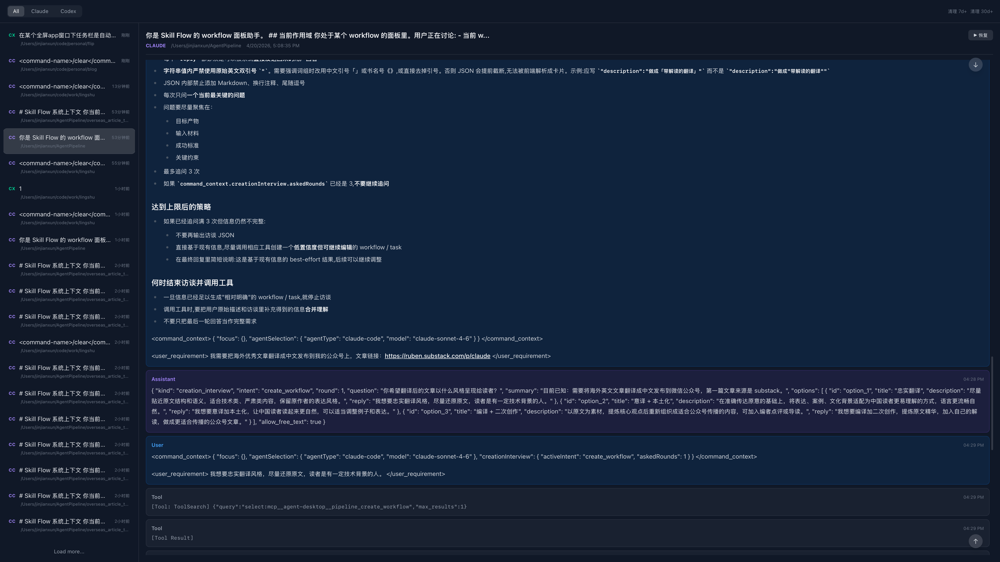
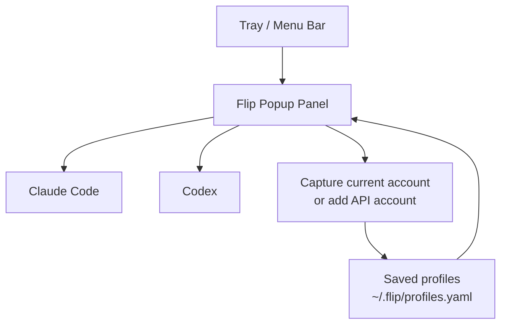

# Flip

[中文说明](README.md)

Flip is a lightweight tray utility for switching and managing local accounts used by `Claude Code` and `Codex`.

## Overview

Flip keeps account switching close to where you work:

- Manage `Claude Code` and `Codex` accounts from a single popup panel
- Capture the current live account into saved profiles
- Add API accounts manually
- Import existing accounts from `CC Switch`
- Show plan quota usage for the currently active account
- Browse session history and reopen related resources
- Keep the displayed “current account” aligned with the actual live configuration

## Screenshots

### Account popup



### Session history



The session view helps you review historical `Claude Code` and `Codex` conversations, filter by agent, inspect message details, clean old records, and resume a session from its original context.

## Workflow



## Tech Stack

- Frontend: `React 19` + `TypeScript` + `Vite`
- Desktop shell: `Tauri 2`
- Backend: `Rust`
- Styling and motion: `Tailwind CSS 4` + `Framer Motion`

## Features

### Account management

- Switch between saved `plan` and `api` accounts
- Capture the current live identity from local agent config
- Add API credentials manually
- Remove stale accounts from the saved list
- Rename saved accounts in the popup

### Integrations

- Import providers from `~/.cc-switch/cc-switch.db`
- Open the local Flip config file directly
- Read live model / reasoning info for each agent
- Reconcile saved “current” status with real live config

### Sessions and quota

- Display plan quota usage in the popup
- Open the sessions window
- Scan saved session records and resume sessions

## Development

### Requirements

- `Node.js 22+`
- `pnpm`
- `Rust stable`
- Tauri system dependencies for your platform

### Install

```bash
pnpm install
```

### Run in development

```bash
pnpm tauri dev
```

### Build

```bash
pnpm tauri build
```

### Faster local packaging

```bash
pnpm tauri build -- --profile dev-release
```

## Project Structure

```text
src/                 React popup and session UI
src-tauri/src/       Tauri / Rust backend
src-tauri/icons/     App icons
src-tauri/patches/   Local dependency patches
docs/                README assets
```

## Notes

- Flip stores saved profiles in `~/.flip/profiles.yaml`
- The app focuses on local account switching rather than cloud-side account management
- Current releases are packaged for `macOS` and `Windows`
