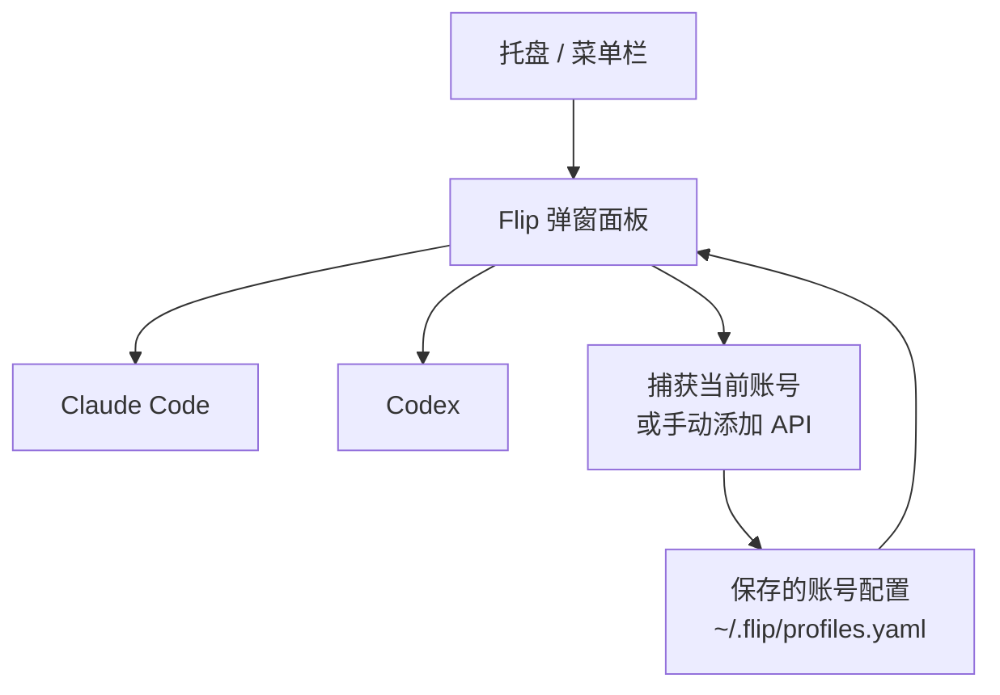

# Flip

[English](README.md)

Flip 是一个轻量的托盘工具，用来切换和管理本机 `Claude Code` 与 `Codex` 的账号。

## 简介

Flip 把常用的账号切换能力收敛到一个面板里：

- 在同一个弹窗里管理 `Claude Code` 和 `Codex`
- 捕获当前 live 配置并保存为账号
- 手动添加 API 账号
- 从 `CC Switch` 导入已有账号
- 展示当前激活 `Plan` 账号的额度使用情况
- 查看会话记录并恢复会话
- 让“当前使用中的账号”跟实际 live 配置保持一致

## 效果图

### 账号弹窗


### 会话记录


会话窗口可以查看历史 `Claude Code` 和 `Codex` 对话，按 agent 过滤，查看消息详情，清理旧记录，并从原始上下文恢复会话。

## 工作流



## 技术栈

- 前端：`React 19` + `TypeScript` + `Vite`
- 桌面容器：`Tauri 2`
- 后端：`Rust`
- 样式与动效：`Tailwind CSS 4` + `Framer Motion`

## 功能

### 账号管理

- 在已保存的 `plan` / `api` 账号之间切换
- 从本地 agent live 配置里捕获当前身份
- 手动录入 API 凭证
- 删除无效或不再需要的账号
- 在弹窗里重命名已保存账号

### 集成能力

- 从 `~/.cc-switch/cc-switch.db` 导入 provider
- 直接打开 Flip 本地配置文件
- 读取每个 agent 当前的模型和推理强度
- 用真实 live 配置回填“当前账号”展示状态

### 会话与额度

- 在弹窗里展示 `Plan` 额度
- 打开会话窗口
- 扫描历史会话并恢复会话

## 开发

### 环境要求

- `Node.js 22+`
- `pnpm`
- `Rust stable`
- 对应平台的 Tauri 系统依赖

### 安装依赖

```bash
pnpm install
```

### 本地开发

```bash
pnpm tauri dev
```

### 正式打包

```bash
pnpm tauri build
```

### 更快的本地打包

```bash
pnpm tauri build -- --profile dev-release
```

## 目录结构

```text
src/                 React 弹窗与会话界面
src-tauri/src/       Tauri / Rust 后端
src-tauri/icons/     应用图标
src-tauri/patches/   本地依赖补丁
docs/                README 素材
```

## 说明

- Flip 的本地配置保存在 `~/.flip/profiles.yaml`
- 这个项目关注的是本地账号切换体验，不负责云端账号管理
- 当前发布产物面向 `macOS` 和 `Windows`
